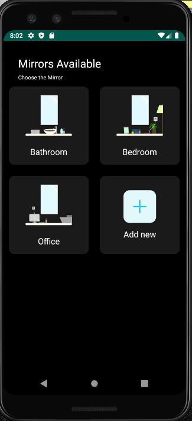
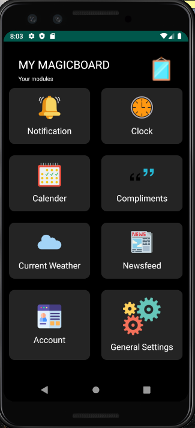
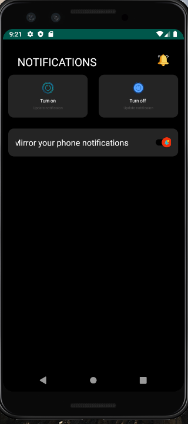
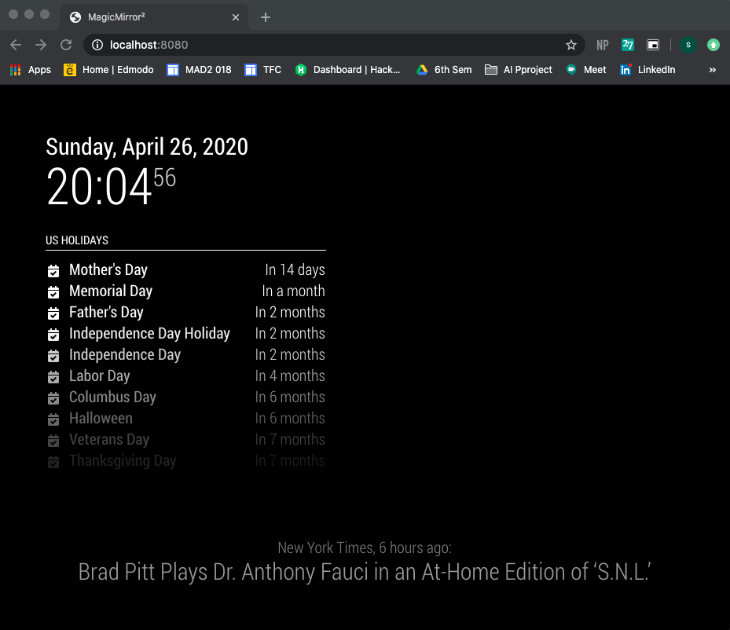

# MAGICAPP

This is an APP to control the MagicMirror/Smart mirror.

FEATURES
-Powering ON/OFF the modules.
-Restart and rebooting the mirror.
-Adjust the brightness
-Hide/show different modules.
-Some modules have inbuilt features, for example the in the news module you can switch between the articles.

